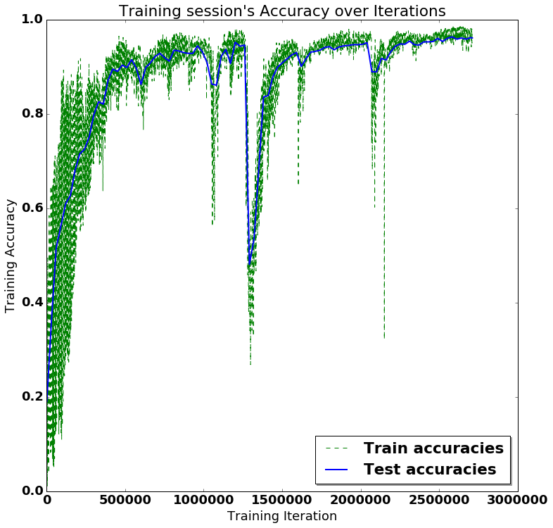
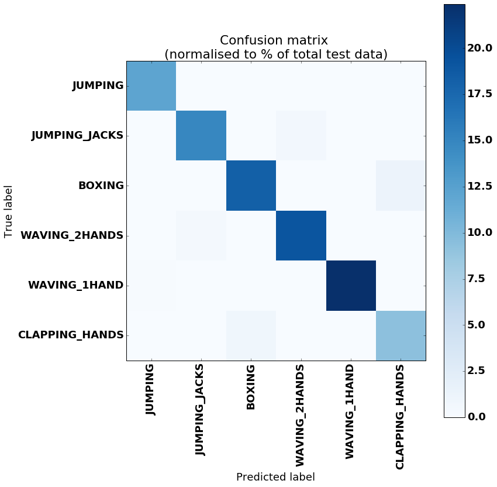

# RNN for Human Activity Recognition - 2D Pose Input

This experiment is the classification of human activities using a 2D pose time series dataset and an LSTM RNN.
The idea is to prove the concept that using a series of 2D poses, rather than 3D poses or a raw 2D images, can produce an accurate estimation of the behaviour of a person or animal.
This is a step towards creating a method of classifying an animal's current behaviour state and predicting it's likely next state, allowing for better interaction with an autonomous mobile robot.

## Objectives

The aims of this experiment are:

-  To determine if 2D pose has comparable accuracy to 3D pose for use in activity recognition. This would allow the use of RGB only cameras for human and animal pose estimation, as opposed to RGBD or a large motion capture dataset.


- To determine if  2D pose has comparable accuracy to using raw RGB images for use in activity recognition. This is based on the idea that limiting the input feature vector can help to deal with a limited dataset, as is likely to occur in animal activity recognition, by allowing for a smaller model to be used (citation required).


- To verify the concept for use in future works involving behaviour prediction from motion in 2D images.

The network used in this experiment is based on that of Guillaume Chevalier, 'LSTMs for Human Activity Recognition, 2016'  https://github.com/guillaume-chevalier/LSTM-Human-Activity-Recognition, available under the MIT License.


## Dataset overview

The dataset consists of pose estimations, made using the software OpenPose (https://github.com/CMU-Perceptual-Computing-Lab/openpose's) on a subset of the Berkeley Multimodal Human Action Database (MHAD) dataset http://tele-immersion.citris-uc.org/berkeley_mhad.

This dataset is comprised of 12 subjects doing the following 6 actions for 5 repetitions, filmed from 4 angles, repeated 5 times each.  

- JUMPING,
- JUMPING_JACKS,
- BOXING,
- WAVING_2HANDS,
- WAVING_1HAND,
- CLAPPING_HANDS.

In total, there are 1438 videos (2 were missing) made up of 211200 individual frames.

The below image is an example of the 4 camera views during the 'boxing' action for subject 1


The input for the LSTM is the 2D position of 18 joints across a timeseries of frames numbering n_steps (window-width), with an associated class label for the frame series.  
A single frame's input (where j refers to a joint) is stored as:

[  j0_x,  j0_y, j1_x, j1_y , j2_x, j2_y, j3_x, j3_y, j4_x, j4_y, j5_x, j5_y, j6_x, j6_y, j7_x, j7_y, j8_x, j8_y, j9_x, j9_y, j10_x, j10_y, j11_x, j11_y, j12_x, j12_y, j13_x, j13_y, j14_x, j14_y, j15_x, j15_y, j16_x, j16_y, j17_x, j17_y ]

For the following experiment, very little preprocessing has been done to the dataset.  
The following steps were taken:
1. openpose run on individual frames, for each subject, action and view, outputting JSON of 18 joint x and y position keypoints and accuracies per frame
2. JSONs converted into txt format, keeping only x and y positions of each frame, action being performed during frame, and order of frames. This is used to create a database of associated activity class number and corresponding series of joint 2D positions
3. No further prepossessing was performed.  

In some cases, multiple people were detected in each frame, in which only the first detection was used.

The data has not been normalised with regards to subject position in the frame, motion across frame (if any), size of the subject, speed of action etc. It is essentially the raw 2D position of each joint viewed from a stationary camera.  
In many cases, individual joints were not located and a position of [0.0,0.0] was given for that joint

A summary of the dataset used for input is:

 - 211200 individual images 
 - n_steps = 33 frames (~=1.5s at 22Hz)
 - Images with noisy pose detection (detection of >=2 people) = 5132  
 - Training_split = 0.8
   - Length X_train = 4519
   - Length X_test = 1197


## Training and Results below: 
Training took approximately 2 mins running on a single GTX1080Ti, and was run for 2,800,000 iterations with a batch size of 1500  (600 epochs)


```python

import numpy as np
import matplotlib
import matplotlib.pyplot as plt
import tensorflow as tf  # Version 1.0.0 (some previous versions are used in past commits)
from sklearn import metrics
from random import randint

import os
```

## Preparing dataset:


```python
# Useful Constants

# Output classes to learn how to classify
LABELS = [    
    "JUMPING",
    "JUMPING_JACKS",
    "BOXING",
    "WAVING_2HANDS",
    "WAVING_1HAND",
    "CLAPPING_HANDS"

] 
DATASET_PATH = "data/HAR_pose_activities/database/"

X_train_path = DATASET_PATH + "x_train.txt"
X_test_path = DATASET_PATH + "x_test.txt"

y_train_path = DATASET_PATH + "y_train.txt"
y_test_path = DATASET_PATH + "y_test.txt"

n_steps = 33 # 33 timesteps per series
```


```python

# Load the networks inputs

def load_X(X_path):
    file = open(X_path, 'r')
    X_ = np.array(
        [elem for elem in [
            row.split(',') for row in file
        ]], 
        dtype=np.float32
    )
    file.close()
    blocks = int(len(X_) / n_steps)
    
    X_ = np.array(np.split(X_,blocks))

    return X_ 

# Load the networks outputs

def load_y(y_path):
    file = open(y_path, 'r')
    y_ = np.array(
        [elem for elem in [
            row.replace('  ', ' ').strip().split(' ') for row in file
        ]], 
        dtype=np.int32
    )
    file.close()
    
    # for 0-based indexing 
    return y_ - 1

X_train = load_X(X_train_path)
X_test = load_X(X_test_path)
#print X_test

y_train = load_y(y_train_path)
y_test = load_y(y_test_path)
# proof that it actually works for the skeptical: replace labelled classes with random classes to train on
#for i in range(len(y_train)):
#    y_train[i] = randint(0, 5)

```

## Set Parameters:


```python
# Input Data 

training_data_count = len(X_train)  # 4519 training series (with 50% overlap between each serie)
test_data_count = len(X_test)  # 1197 test series
n_input = len(X_train[0][0])  # num input parameters per timestep

n_hidden = 32 # Hidden layer num of features
n_classes = 6 

learning_rate = 0.0025
lambda_loss_amount = 0.0015

training_iters = training_data_count *600  # Loop 600 times on the dataset
batch_size = 1500
display_iter = 30000  # To show test set accuracy during training

print("(X shape, y shape, every X's mean, every X's standard deviation)")
print(X_train.shape, y_test.shape, np.mean(X_test), np.std(X_test))
print("\nThe dataset has not been preprocessed, is not normalised etc")


```

    (X shape, y shape, every X's mean, every X's standard deviation)
    ((4519, 33, 36), (1197, 1), 250.95729, 125.17004)
    
    The dataset has not been preprocessed, is not normalised etc


## Utility functions for training:


```python
def LSTM_RNN(_X, _weights, _biases):
    # model architecture based on "guillaume-chevalier" and "aymericdamien" under the MIT license.

    _X = tf.transpose(_X, [1, 0, 2])  # permute n_steps and batch_size
    _X = tf.reshape(_X, [-1, n_input])   
    # Rectifies Linear Unit activation function used
    _X = tf.nn.relu(tf.matmul(_X, _weights['hidden']) + _biases['hidden'])
    # Split data because rnn cell needs a list of inputs for the RNN inner loop
    _X = tf.split(_X, n_steps, 0) 

    # Define two stacked LSTM cells (two recurrent layers deep) with tensorflow
    lstm_cell_1 = tf.contrib.rnn.BasicLSTMCell(n_hidden, forget_bias=1.0, state_is_tuple=True)
    lstm_cell_2 = tf.contrib.rnn.BasicLSTMCell(n_hidden, forget_bias=1.0, state_is_tuple=True)
    lstm_cells = tf.contrib.rnn.MultiRNNCell([lstm_cell_1, lstm_cell_2], state_is_tuple=True)
    outputs, states = tf.contrib.rnn.static_rnn(lstm_cells, _X, dtype=tf.float32)

    # A single output is produced, in style of "many to one" classifier, refer to http://karpathy.github.io/2015/05/21/rnn-effectiveness/ for details
    lstm_last_output = outputs[-1]
    
    # Linear activation
    return tf.matmul(lstm_last_output, _weights['out']) + _biases['out']


def extract_batch_size(_train, step, batch_size):
    # Function to fetch a "batch_size" amount of data from "(X|y)_train" data. 
    
    shape = list(_train.shape)
    shape[0] = batch_size
    batch_s = np.empty(shape)

    for i in range(batch_size):
        # Loop index
        index = ((step-1)*batch_size + i) % len(_train)
        batch_s[i] = _train[index] 

    return batch_s


def one_hot(y_):
    # One hot encoding of the network outputs
    # e.g.: [[5], [0], [3]] --> [[0, 0, 0, 0, 0, 1], [1, 0, 0, 0, 0, 0], [0, 0, 0, 1, 0, 0]]
    
    y_ = y_.reshape(len(y_))
    n_values = int(np.max(y_)) + 1
    return np.eye(n_values)[np.array(y_, dtype=np.int32)]  # Returns FLOATS


```

## Build the network:


```python

# Graph input/output
x = tf.placeholder(tf.float32, [None, n_steps, n_input])
y = tf.placeholder(tf.float32, [None, n_classes])

# Graph weights
weights = {
    'hidden': tf.Variable(tf.random_normal([n_input, n_hidden])), # Hidden layer weights
    'out': tf.Variable(tf.random_normal([n_hidden, n_classes], mean=1.0))
}
biases = {
    'hidden': tf.Variable(tf.random_normal([n_hidden])),
    'out': tf.Variable(tf.random_normal([n_classes]))
}

pred = LSTM_RNN(x, weights, biases)

# Loss, optimizer and evaluation
l2 = lambda_loss_amount * sum(
    tf.nn.l2_loss(tf_var) for tf_var in tf.trainable_variables()
) # L2 loss prevents this overkill neural network to overfit the data
cost = tf.reduce_mean(tf.nn.softmax_cross_entropy_with_logits(labels=y, logits=pred)) + l2 # Softmax loss
optimizer = tf.train.AdamOptimizer(learning_rate=learning_rate).minimize(cost) # Adam Optimizer

correct_pred = tf.equal(tf.argmax(pred,1), tf.argmax(y,1))
accuracy = tf.reduce_mean(tf.cast(correct_pred, tf.float32))


```

## Train the network:


```python
test_losses = []
test_accuracies = []
train_losses = []
train_accuracies = []
sess = tf.InteractiveSession(config=tf.ConfigProto(log_device_placement=True))
init = tf.global_variables_initializer()
sess.run(init)

# Perform Training steps with "batch_size" amount of example data at each loop
step = 1
while step * batch_size <= training_iters:
    batch_xs = extract_batch_size(X_train, step, batch_size)
    batch_ys = one_hot(extract_batch_size(y_train, step, batch_size))
    # check that encoded output is same length as num_classes, if not, pad it 
    if len(batch_ys[0]) < n_classes:
        temp_ys = np.zeros((batch_size, n_classes))
        temp_ys[:batch_ys.shape[0],:batch_ys.shape[1]] = batch_ys
        batch_ys = temp_ys
       
    

    # Fit training using batch data
    _, loss, acc = sess.run(
        [optimizer, cost, accuracy],
        feed_dict={
            x: batch_xs, 
            y: batch_ys
        }
    )
    train_losses.append(loss)
    train_accuracies.append(acc)
    
    # Evaluate network only at some steps for faster training: 
    if (step*batch_size % display_iter == 0) or (step == 1) or (step * batch_size > training_iters):
        
        # To not spam console, show training accuracy/loss in this "if"
        print("Training iter #" + str(step*batch_size) + \
              ":   Batch Loss = " + "{:.6f}".format(loss) + \
              ", Accuracy = {}".format(acc))
        
        # Evaluation on the test set (no learning made here - just evaluation for diagnosis)
        loss, acc = sess.run(
            [cost, accuracy], 
            feed_dict={
                x: X_test,
                y: one_hot(y_test)
            }
        )
        test_losses.append(loss)
        test_accuracies.append(acc)
        print("PERFORMANCE ON TEST SET: " + \
              "Batch Loss = {}".format(loss) + \
              ", Accuracy = {}".format(acc))

    step += 1

print("Optimization Finished!")

# Accuracy for test data

one_hot_predictions, accuracy, final_loss = sess.run(
    [pred, accuracy, cost],
    feed_dict={
        x: X_test,
        y: one_hot(y_test)
    }
)

test_losses.append(final_loss)
test_accuracies.append(accuracy)

print("FINAL RESULT: " + \
      "Batch Loss = {}".format(final_loss) + \
      ", Accuracy = {}".format(accuracy))

```

    Training iter #1500:   Batch Loss = 3.002675, Accuracy = 0.258666664362
    PERFORMANCE ON TEST SET: Batch Loss = 3.78618001938, Accuracy = 0.151211366057
    Training iter #30000:   Batch Loss = 2.445692, Accuracy = 0.680000007153
    PERFORMANCE ON TEST SET: Batch Loss = 2.824634552, Accuracy = 0.394319117069
    Training iter #60000:   Batch Loss = 2.599057, Accuracy = 0.20000000298
    PERFORMANCE ON TEST SET: Batch Loss = 2.3894431591, Accuracy = 0.515455305576
    Training iter #90000:   Batch Loss = 1.882277, Accuracy = 0.791999995708
    PERFORMANCE ON TEST SET: Batch Loss = 2.12247848511, Accuracy = 0.5873016119
    Training iter #120000:   Batch Loss = 1.940088, Accuracy = 0.686666667461
    PERFORMANCE ON TEST SET: Batch Loss = 1.91880702972, Accuracy = 0.670843780041
    Training iter #150000:   Batch Loss = 2.048403, Accuracy = 0.570666670799
    PERFORMANCE ON TEST SET: Batch Loss = 1.92353081703, Accuracy = 0.660818696022
    Training iter #180000:   Batch Loss = 1.686332, Accuracy = 0.810000002384
    PERFORMANCE ON TEST SET: Batch Loss = 1.80752873421, Accuracy = 0.715956568718
    Training iter #210000:   Batch Loss = 1.818619, Accuracy = 0.699999988079
    PERFORMANCE ON TEST SET: Batch Loss = 1.65521407127, Accuracy = 0.79365080595
    Training iter #240000:   Batch Loss = 1.526818, Accuracy = 0.846000015736
    PERFORMANCE ON TEST SET: Batch Loss = 1.59782338142, Accuracy = 0.811194658279
    Training iter #270000:   Batch Loss = 1.451946, Accuracy = 0.878666639328
    PERFORMANCE ON TEST SET: Batch Loss = 1.51213991642, Accuracy = 0.847117781639
    Training iter #300000:   Batch Loss = 1.562773, Accuracy = 0.797333359718
    PERFORMANCE ON TEST SET: Batch Loss = 1.54216206074, Accuracy = 0.837092757225
    Training iter #330000:   Batch Loss = 1.578571, Accuracy = 0.832000017166
    PERFORMANCE ON TEST SET: Batch Loss = 1.61438763142, Accuracy = 0.802004992962
    Training iter #360000:   Batch Loss = 1.602509, Accuracy = 0.730000019073
    PERFORMANCE ON TEST SET: Batch Loss = 1.44531750679, Accuracy = 0.870509624481
    Training iter #390000:   Batch Loss = 1.470941, Accuracy = 0.856000006199
    PERFORMANCE ON TEST SET: Batch Loss = 1.39394760132, Accuracy = 0.876357555389
    Training iter #420000:   Batch Loss = 1.245456, Accuracy = 0.939333319664
    PERFORMANCE ON TEST SET: Batch Loss = 1.35609531403, Accuracy = 0.889724314213
    Training iter #450000:   Batch Loss = 1.310967, Accuracy = 0.885333359241
    PERFORMANCE ON TEST SET: Batch Loss = 1.30475795269, Accuracy = 0.903926491737
    Training iter #480000:   Batch Loss = 1.351498, Accuracy = 0.894666671753
    PERFORMANCE ON TEST SET: Batch Loss = 1.27563393116, Accuracy = 0.915622413158
    Training iter #510000:   Batch Loss = 1.194753, Accuracy = 0.938666641712
    PERFORMANCE ON TEST SET: Batch Loss = 1.29639327526, Accuracy = 0.903091073036
    Training iter #540000:   Batch Loss = 1.347552, Accuracy = 0.882000029087
    PERFORMANCE ON TEST SET: Batch Loss = 1.26787257195, Accuracy = 0.910609841347
    Training iter #570000:   Batch Loss = 1.270686, Accuracy = 0.911333322525
    PERFORMANCE ON TEST SET: Batch Loss = 1.22352743149, Accuracy = 0.931495428085
    Training iter #600000:   Batch Loss = 1.115613, Accuracy = 0.967999994755
    PERFORMANCE ON TEST SET: Batch Loss = 1.19370794296, Accuracy = 0.934001684189
    Training iter #630000:   Batch Loss = 1.248551, Accuracy = 0.896000027657
    PERFORMANCE ON TEST SET: Batch Loss = 1.19298970699, Accuracy = 0.927318274975
    Training iter #660000:   Batch Loss = 1.220496, Accuracy = 0.920000016689
    PERFORMANCE ON TEST SET: Batch Loss = 1.26574254036, Accuracy = 0.895572245121
    Training iter #690000:   Batch Loss = 1.165517, Accuracy = 0.939333319664
    PERFORMANCE ON TEST SET: Batch Loss = 1.2178286314, Accuracy = 0.91311609745
    Training iter #720000:   Batch Loss = 1.149393, Accuracy = 0.953999996185
    PERFORMANCE ON TEST SET: Batch Loss = 1.17217302322, Accuracy = 0.937343358994
    Training iter #750000:   Batch Loss = 1.088307, Accuracy = 0.967999994755
    PERFORMANCE ON TEST SET: Batch Loss = 1.15463244915, Accuracy = 0.937343358994
    Training iter #780000:   Batch Loss = 1.099577, Accuracy = 0.948000013828
    PERFORMANCE ON TEST SET: Batch Loss = 1.12242722511, Accuracy = 0.94569760561
    Training iter #810000:   Batch Loss = 1.117199, Accuracy = 0.962000012398
    PERFORMANCE ON TEST SET: Batch Loss = 1.10891962051, Accuracy = 0.954051792622
    Training iter #840000:   Batch Loss = 1.262746, Accuracy = 0.925999999046
    PERFORMANCE ON TEST SET: Batch Loss = 1.26809370518, Accuracy = 0.890559732914
    Training iter #870000:   Batch Loss = 1.330188, Accuracy = 0.853999972343
    PERFORMANCE ON TEST SET: Batch Loss = 1.3056179285, Accuracy = 0.872180461884
    Training iter #900000:   Batch Loss = 1.281911, Accuracy = 0.885999977589
    PERFORMANCE ON TEST SET: Batch Loss = 1.2711379528, Accuracy = 0.880534648895
    Training iter #930000:   Batch Loss = 1.024835, Accuracy = 0.977999985218
    PERFORMANCE ON TEST SET: Batch Loss = 1.35268330574, Accuracy = 0.84043443203
    Training iter #960000:   Batch Loss = 1.134375, Accuracy = 0.92733335495
    PERFORMANCE ON TEST SET: Batch Loss = 1.13562190533, Accuracy = 0.932330846786
    Training iter #990000:   Batch Loss = 1.090131, Accuracy = 0.956666648388
    PERFORMANCE ON TEST SET: Batch Loss = 1.11268639565, Accuracy = 0.943191289902
    Training iter #1020000:   Batch Loss = 1.025815, Accuracy = 0.969333350658
    PERFORMANCE ON TEST SET: Batch Loss = 1.08431065083, Accuracy = 0.949874699116
    Training iter #1050000:   Batch Loss = 1.010896, Accuracy = 0.975333333015
    PERFORMANCE ON TEST SET: Batch Loss = 1.07088029385, Accuracy = 0.95321637392
    Training iter #1080000:   Batch Loss = 1.011731, Accuracy = 0.981999993324
    PERFORMANCE ON TEST SET: Batch Loss = 1.05977535248, Accuracy = 0.95321637392
    Training iter #1110000:   Batch Loss = 1.012283, Accuracy = 0.96266669035
    PERFORMANCE ON TEST SET: Batch Loss = 1.04590642452, Accuracy = 0.955722630024
    Training iter #1140000:   Batch Loss = 1.025745, Accuracy = 0.971333324909
    PERFORMANCE ON TEST SET: Batch Loss = 1.03864955902, Accuracy = 0.956558048725
    Training iter #1170000:   Batch Loss = 0.950556, Accuracy = 0.990000009537
    PERFORMANCE ON TEST SET: Batch Loss = 1.0396335125, Accuracy = 0.956558048725
    Training iter #1200000:   Batch Loss = 1.004042, Accuracy = 0.959999978542
    PERFORMANCE ON TEST SET: Batch Loss = 1.03576493263, Accuracy = 0.957393467426
    Training iter #1230000:   Batch Loss = 0.992851, Accuracy = 0.97866666317
    PERFORMANCE ON TEST SET: Batch Loss = 1.03129959106, Accuracy = 0.954887211323
    Training iter #1260000:   Batch Loss = 0.928279, Accuracy = 0.992666661739
    PERFORMANCE ON TEST SET: Batch Loss = 1.26870107651, Accuracy = 0.877192974091
    Training iter #1290000:   Batch Loss = 1.196740, Accuracy = 0.882000029087
    PERFORMANCE ON TEST SET: Batch Loss = 1.36489009857, Accuracy = 0.837928175926
    Training iter #1320000:   Batch Loss = 1.203769, Accuracy = 0.866666674614
    PERFORMANCE ON TEST SET: Batch Loss = 1.1889384985, Accuracy = 0.900584816933
    Training iter #1350000:   Batch Loss = 1.024922, Accuracy = 0.952000021935
    PERFORMANCE ON TEST SET: Batch Loss = 1.07638597488, Accuracy = 0.939849615097
    Training iter #1380000:   Batch Loss = 1.009360, Accuracy = 0.954666674137
    PERFORMANCE ON TEST SET: Batch Loss = 1.03899145126, Accuracy = 0.952380955219
    Training iter #1410000:   Batch Loss = 1.006346, Accuracy = 0.959333360195
    PERFORMANCE ON TEST SET: Batch Loss = 1.02345991135, Accuracy = 0.957393467426
    Training iter #1440000:   Batch Loss = 0.985984, Accuracy = 0.958666682243
    PERFORMANCE ON TEST SET: Batch Loss = 1.00125956535, Accuracy = 0.960735142231
    Training iter #1470000:   Batch Loss = 0.980257, Accuracy = 0.9646666646
    PERFORMANCE ON TEST SET: Batch Loss = 0.996235132217, Accuracy = 0.961570620537
    Training iter #1500000:   Batch Loss = 0.926247, Accuracy = 0.984666645527
    PERFORMANCE ON TEST SET: Batch Loss = 0.992841601372, Accuracy = 0.960735142231
    Training iter #1530000:   Batch Loss = 0.967732, Accuracy = 0.961333334446
    PERFORMANCE ON TEST SET: Batch Loss = 0.985228538513, Accuracy = 0.963241457939
    Training iter #1560000:   Batch Loss = 0.968244, Accuracy = 0.967333316803
    PERFORMANCE ON TEST SET: Batch Loss = 0.979355573654, Accuracy = 0.960735142231
    Training iter #1590000:   Batch Loss = 0.897679, Accuracy = 0.986666679382
    PERFORMANCE ON TEST SET: Batch Loss = 0.973662912846, Accuracy = 0.96407687664
    Training iter #1620000:   Batch Loss = 1.402292, Accuracy = 0.79266667366
    PERFORMANCE ON TEST SET: Batch Loss = 1.48164653778, Accuracy = 0.767752707005
    Training iter #1650000:   Batch Loss = 1.345531, Accuracy = 0.833333313465
    PERFORMANCE ON TEST SET: Batch Loss = 1.38350605965, Accuracy = 0.791144549847
    Training iter #1680000:   Batch Loss = 1.932903, Accuracy = 0.623333334923
    PERFORMANCE ON TEST SET: Batch Loss = 1.4390335083, Accuracy = 0.771094381809
    Training iter #1710000:   Batch Loss = 1.381469, Accuracy = 0.682666659355
    PERFORMANCE ON TEST SET: Batch Loss = 1.24894285202, Accuracy = 0.817878007889
    Training iter #1740000:   Batch Loss = 1.085604, Accuracy = 0.905333340168
    PERFORMANCE ON TEST SET: Batch Loss = 1.13980698586, Accuracy = 0.883040964603
    Training iter #1770000:   Batch Loss = 1.157635, Accuracy = 0.867333352566
    PERFORMANCE ON TEST SET: Batch Loss = 1.10831093788, Accuracy = 0.903091073036
    Training iter #1800000:   Batch Loss = 1.092051, Accuracy = 0.907333314419
    PERFORMANCE ON TEST SET: Batch Loss = 1.07707548141, Accuracy = 0.911445260048
    Training iter #1830000:   Batch Loss = 0.976066, Accuracy = 0.945333361626
    PERFORMANCE ON TEST SET: Batch Loss = 1.06849527359, Accuracy = 0.912280678749
    Training iter #1860000:   Batch Loss = 1.056159, Accuracy = 0.910000026226
    PERFORMANCE ON TEST SET: Batch Loss = 1.0618929863, Accuracy = 0.920634925365
    Training iter #1890000:   Batch Loss = 1.082558, Accuracy = 0.916666686535
    PERFORMANCE ON TEST SET: Batch Loss = 1.02216088772, Accuracy = 0.934001684189
    Training iter #1920000:   Batch Loss = 0.936326, Accuracy = 0.959333360195
    PERFORMANCE ON TEST SET: Batch Loss = 1.02668190002, Accuracy = 0.930660009384
    Training iter #1950000:   Batch Loss = 1.000848, Accuracy = 0.936666667461
    PERFORMANCE ON TEST SET: Batch Loss = 1.02565193176, Accuracy = 0.926482856274
    Training iter #1980000:   Batch Loss = 1.142277, Accuracy = 0.857333362103
    PERFORMANCE ON TEST SET: Batch Loss = 1.04767978191, Accuracy = 0.919799506664
    Training iter #2010000:   Batch Loss = 1.071959, Accuracy = 0.928666651249
    PERFORMANCE ON TEST SET: Batch Loss = 1.15300953388, Accuracy = 0.891395151615
    Training iter #2040000:   Batch Loss = 1.027824, Accuracy = 0.916000008583
    PERFORMANCE ON TEST SET: Batch Loss = 1.01519656181, Accuracy = 0.939014196396
    Training iter #2070000:   Batch Loss = 0.977566, Accuracy = 0.934666693211
    PERFORMANCE ON TEST SET: Batch Loss = 0.983981132507, Accuracy = 0.942355871201
    Training iter #2100000:   Batch Loss = 0.926960, Accuracy = 0.952666640282
    PERFORMANCE ON TEST SET: Batch Loss = 0.960254609585, Accuracy = 0.950710117817
    Training iter #2130000:   Batch Loss = 0.908395, Accuracy = 0.970666646957
    PERFORMANCE ON TEST SET: Batch Loss = 0.951446056366, Accuracy = 0.95321637392
    Training iter #2160000:   Batch Loss = 0.898269, Accuracy = 0.966666638851
    PERFORMANCE ON TEST SET: Batch Loss = 0.948422908783, Accuracy = 0.954051792622
    Training iter #2190000:   Batch Loss = 0.993827, Accuracy = 0.920000016689
    PERFORMANCE ON TEST SET: Batch Loss = 0.944044470787, Accuracy = 0.952380955219
    Training iter #2220000:   Batch Loss = 0.924159, Accuracy = 0.956666648388
    PERFORMANCE ON TEST SET: Batch Loss = 0.936273753643, Accuracy = 0.958228886127
    Training iter #2250000:   Batch Loss = 0.843489, Accuracy = 0.982666671276
    PERFORMANCE ON TEST SET: Batch Loss = 0.953592300415, Accuracy = 0.948203861713
    Training iter #2280000:   Batch Loss = 1.506708, Accuracy = 0.660666644573
    PERFORMANCE ON TEST SET: Batch Loss = 1.19939804077, Accuracy = 0.859649121761
    Training iter #2310000:   Batch Loss = 1.097816, Accuracy = 0.885999977589
    PERFORMANCE ON TEST SET: Batch Loss = 1.08001160622, Accuracy = 0.888888895512
    Training iter #2340000:   Batch Loss = 0.964344, Accuracy = 0.934000015259
    PERFORMANCE ON TEST SET: Batch Loss = 0.987343966961, Accuracy = 0.935672521591
    Training iter #2370000:   Batch Loss = 0.930675, Accuracy = 0.956666648388
    PERFORMANCE ON TEST SET: Batch Loss = 0.94130396843, Accuracy = 0.949874699116
    Training iter #2400000:   Batch Loss = 0.905463, Accuracy = 0.949999988079
    PERFORMANCE ON TEST SET: Batch Loss = 0.933781504631, Accuracy = 0.950710117817
    Training iter #2430000:   Batch Loss = 0.864785, Accuracy = 0.970666646957
    PERFORMANCE ON TEST SET: Batch Loss = 0.91543161869, Accuracy = 0.957393467426
    Training iter #2460000:   Batch Loss = 0.874170, Accuracy = 0.972666680813
    PERFORMANCE ON TEST SET: Batch Loss = 0.90301412344, Accuracy = 0.96407687664
    Training iter #2490000:   Batch Loss = 0.872222, Accuracy = 0.955999970436
    PERFORMANCE ON TEST SET: Batch Loss = 0.905952513218, Accuracy = 0.960735142231
    Training iter #2520000:   Batch Loss = 0.852570, Accuracy = 0.970666646957
    PERFORMANCE ON TEST SET: Batch Loss = 0.89778149128, Accuracy = 0.961570620537
    Training iter #2550000:   Batch Loss = 0.842460, Accuracy = 0.975333333015
    PERFORMANCE ON TEST SET: Batch Loss = 0.902466118336, Accuracy = 0.959064304829
    Training iter #2580000:   Batch Loss = 0.799149, Accuracy = 0.990000009537
    PERFORMANCE ON TEST SET: Batch Loss = 0.894698381424, Accuracy = 0.957393467426
    Training iter #2610000:   Batch Loss = 0.830180, Accuracy = 0.981333315372
    PERFORMANCE ON TEST SET: Batch Loss = 0.887227118015, Accuracy = 0.958228886127
    Training iter #2640000:   Batch Loss = 0.852923, Accuracy = 0.963333308697
    PERFORMANCE ON TEST SET: Batch Loss = 0.886450111866, Accuracy = 0.957393467426
    Training iter #2670000:   Batch Loss = 0.842465, Accuracy = 0.975333333015
    PERFORMANCE ON TEST SET: Batch Loss = 1.0841562748, Accuracy = 0.888888895512
    Training iter #2700000:   Batch Loss = 0.922328, Accuracy = 0.952666640282
    PERFORMANCE ON TEST SET: Batch Loss = 0.910977244377, Accuracy = 0.951545536518
    Optimization Finished!
    FINAL RESULT: Batch Loss = 0.82083427906, Accuracy = 0.961570620537


## Results:


```python
# (Inline plots: )
%matplotlib inline

font = {
    'family' : 'Bitstream Vera Sans',
    'weight' : 'bold',
    'size'   : 18
}
matplotlib.rc('font', **font)

width = 12
height = 12
plt.figure(figsize=(width, height))

indep_train_axis = np.array(range(batch_size, (len(train_losses)+1)*batch_size, batch_size))
#plt.plot(indep_train_axis, np.array(train_losses),     "b--", label="Train losses")
plt.plot(indep_train_axis, np.array(train_accuracies), "g--", label="Train accuracies")

indep_test_axis = np.append(
    np.array(range(batch_size, len(test_losses)*display_iter, display_iter)[:-1]),
    [training_iters]
)
#plt.plot(indep_test_axis, np.array(test_losses), "b-", linewidth=2.0, label="Test losses")
plt.plot(indep_test_axis, np.array(test_accuracies), "b-", linewidth=2.0, label="Test accuracies")

plt.title("Training session's Accuracy over Iterations")
plt.legend(loc='lower right', shadow=True)
plt.ylabel('Training Accuracy')
plt.xlabel('Training Iteration')

plt.show()

# Results

predictions = one_hot_predictions.argmax(1)

print("Testing Accuracy: {}%".format(100*accuracy))

print("")
print("Precision: {}%".format(100*metrics.precision_score(y_test, predictions, average="weighted")))
print("Recall: {}%".format(100*metrics.recall_score(y_test, predictions, average="weighted")))
print("f1_score: {}%".format(100*metrics.f1_score(y_test, predictions, average="weighted")))

print("")
print("Confusion Matrix:")
print("Created using test set of {} datapoints, normalised to % of each class in the test dataset".format(len(y_test)))
confusion_matrix = metrics.confusion_matrix(y_test, predictions)


#print(confusion_matrix)
normalised_confusion_matrix = np.array(confusion_matrix, dtype=np.float32)/np.sum(confusion_matrix)*100


# Plot Results: 
width = 12
height = 12
plt.figure(figsize=(width, height))
plt.imshow(
    normalised_confusion_matrix, 
    interpolation='nearest', 
    cmap=plt.cm.Blues
)
plt.title("Confusion matrix \n(normalised to % of total test data)")
plt.colorbar()
tick_marks = np.arange(n_classes)
plt.xticks(tick_marks, LABELS, rotation=90)
plt.yticks(tick_marks, LABELS)
plt.tight_layout()
plt.ylabel('True label')
plt.xlabel('Predicted label')
plt.show()

```


    Testing Accuracy: 86.2990796566%
    
    Precision: 86.7570501739%
    Recall: 86.2990810359%
    f1_score: 86.0564699152%
    
    Confusion Matrix:
    Created using test set of 1197 datapoints, normalised to % of each class in the test dataset






```python
#sess.close()
```

## Conclusion

Final accuracy of >90% is pretty good, considering that training took <2mins. There are significant spikes in decreased accuracy even far into training, which suggests the need for more data.

Noticeable confusion between activities of Clapping Hands and Boxing, and between Jumping Jacks and Waving Two Hands which is understandable.

In terms of the applicability of this to a wider dataset, I would imagine that it would be able to work for any activities in which the training included a views from all angles to be tested on. It would be interesting to see it's applicability to other, in-between views.

It should be noted, that this test was run about 10 times, and that 9 out of 10 times an accuracy between 85% and 95% was achieved, however an accuracy of ~=45% was achieved one time.Perhaps this was due to random initialising and local minima, however not enough tests have been performed to confirm. 

 Overall, this experiment validates the idea that 2D pose can be used for at least human activity recognition, and provides verification to continue onto use of 2D pose for behaviour estimation in both people and animals
 
 

## Future Works

Possibility to extend into a bidirectional-LSTM   (https://github.com/guillaume-chevalier/HAR-stacked-residual-bidir-LSTMs)

Use on more subtle activity classes, such as walking versus running, agitated movement versus calm movement,  and perhaps normal versus abnormal behaviour, based on a baseline of normal motion.


## References

The dataset can be found at http://tele-immersion.citris-uc.org/berkeley_mhad released under the BSD-2 license
>Copyright (c) 2013, Regents of the University of California All rights reserved.

The network used in this experiment is based on the following, available under the [MIT License](https://github.com/guillaume-chevalier/LSTM-Human-Activity-Recognition/blob/master/LICENSE). :
> Guillaume Chevalier, LSTMs for Human Activity Recognition, 2016
> https://github.com/guillaume-chevalier/LSTM-Human-Activity-Recognition


```python
# Let's convert this notebook to a README for the GitHub project's title page:
!jupyter nbconvert --to markdown LSTM.ipynb
!mv LSTM.md README.md
```

    [NbConvertApp] Converting notebook LSTM.ipynb to markdown
    [NbConvertApp] Support files will be in LSTM_files/
    [NbConvertApp] Making directory LSTM_files
    [NbConvertApp] Making directory LSTM_files
    [NbConvertApp] Writing 31889 bytes to LSTM.md

