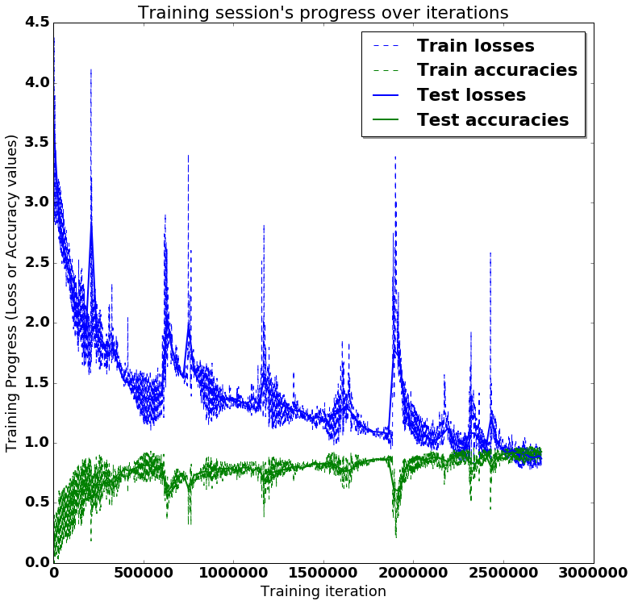
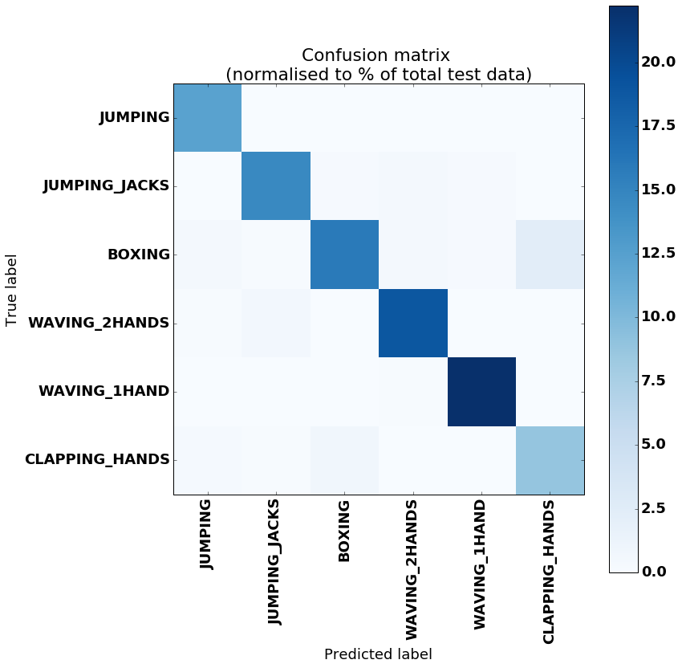

# RNN for Human Activity Recognition - 2D Pose Input

This experiment aims to determine the level of accuracy attainable in Human activity recognition using a 2D body pose dataset and an LSTM RNN. This involves classifying the type of movement amongst six categories:
- JUMPING,
- JUMPING_JACKS,
- BOXING,
- WAVING_2HANDS,
- WAVING_1HAND,
- CLAPPING_HANDS.

The motivation behind this experiment is to determine if:

- 2D pose has comparable accuracy to 3D pose for activity estimation using an LSTM RNN, allowing the use of RGB only cameras for pose estimation, as opposed to RGBD or a large motion capture dataset.

- 2D pose has comparable accuracy to using raw RGB images for activity estimation using an LSTM RNN. This is based on the assumption that limiting the input feature vector may help to deal with a limited dataset (citation required)

- Verify the concept for use in future works involving behaviour prediction from motion in 2D images


## Dataset overview

The dataset is comprised of pose estimations, made using the software OpenPose (https://github.com/CMU-Perceptual-Computing-Lab/openpose's) on a subset of the Berkeley Multimodal Human Action Database (MHAD) dataset http://tele-immersion.citris-uc.org/berkeley_mhad.

This dataset is composed of 12 subjects doing the 6 listed actions for 5 repetitions, filmed from 4 angles, repeated 5 times each.  
In total, there are 1438 videos (2 were missing) made up of 211200 individual frames.

The below image is an example of the 4 camera views during the 'boxing' action for subject 1


The input for the LSTM is the 2D position of 18 joints across a timeseries of frames numbering n_steps (window-width), with an associated class label for the frame series.  
A single frame's input (where j refers to a joint) is stored as:

[  j0_x,  j0_y, j1_x, j1_y , j2_x, j2_y, j3_x, j3_y, j4_x, j4_y, j5_x, j5_y, j6_x, j6_y, j7_x, j7_y, j8_x, j8_y, j9_x, j9_y, j10_x, j10_y, j11_x, j11_y, j12_x, j12_y, j13_x, j13_y, j14_x, j14_y, j15_x, j15_y, j16_x, j16_y, j17_x, j17_y ]

For the following experiment, very little preprocessing has been done to the dataset.  
The following steps were taken:
1. openpose run on individual frames, for each subject, action and view, outputting JSON of 18 joint x and y position keypoints and accuracies per frame
2. JSONs converted into txt format, keeping only x and y positions of each frame, action being performed during frame, and order of frames. This is used to create a database of associated activity class number and corresponding series of joint 2D positions
3. No further prepossessing was performed.  

In some cases, multiple people were detected in each frame, in which only the first detection was used.

The data has not been normalised with regards to subject position in the frame, motion across frame (if any), size of the subject, speed of action etc. It is essentially the raw 2D position of each joint viewed from a stationary camera.  
In many cases, individual joints were not located and a position of [0.0,0.0] was given for that joint

A summary of the dataset used for input is:

 - 211200 individual images 
 - n_steps = 33 frames (~=1.5s at 22Hz)
 - Images with noisy pose detection (detection of >=2 people) = 5132  
 - Training_split = 0.8
   - Length X_train = 4519
   - Length X_test = 1197


## Training and Results below: 


```python

import numpy as np
import matplotlib
import matplotlib.pyplot as plt
import tensorflow as tf  # Version 1.0.0 (some previous versions are used in past commits)
from sklearn import metrics
from random import randint

import os
```


```python
# Useful Constants

# Output classes to learn how to classify
LABELS = [    
    "JUMPING",
    "JUMPING_JACKS",
    "BOXING",
    "WAVING_2HANDS",
    "WAVING_1HAND",
    "CLAPPING_HANDS"

] 
DATASET_PATH = "data/HAR_pose_activities/database/"

X_train_path = DATASET_PATH + "x_train.txt"
X_test_path = DATASET_PATH + "x_test.txt"

y_train_path = DATASET_PATH + "y_train.txt"
y_test_path = DATASET_PATH + "y_test.txt"

n_steps = 33 # 33 timesteps per series
```

## Preparing dataset:


```python

# Load "X" (the neural network's training and testing inputs)

def load_X(X_path):
    file = open(X_path, 'r')
    # Read dataset from disk, dealing with text files' syntax
    X_ = np.array(
        [elem for elem in [
            row.split(',') for row in file
        ]], 
        dtype=np.float32
    )
    file.close()
    blocks = int(len(X_) / n_steps)
    
    X_ = np.array(np.split(X_,blocks))

    return X_ #np.transpose(np.array(X_), (1, 2, 0))

# Load "y" (the neural network's training and testing outputs)

def load_y(y_path):
    file = open(y_path, 'r')
    # Read dataset from disk, dealing with text file's syntax
    y_ = np.array(
        [elem for elem in [
            row.replace('  ', ' ').strip().split(' ') for row in file
        ]], 
        dtype=np.int32
    )
    file.close()
    
    # for 0-based indexing 
    return y_ - 1

X_train = load_X(X_train_path)
X_test = load_X(X_test_path)
#print X_test

y_train = load_y(y_train_path)
y_test = load_y(y_test_path)
# proof that it actually works for the skeptical: replace labelled classes with random classes to train on
#for i in range(len(y_train)):
#    y_train[i] = randint(0, 5)

```

## Additional Parameters:

Here are some core parameter definitions for the training. 

The whole neural network's structure could be summarised by enumerating those parameters and the fact an LSTM is used. 


```python
# Input Data 

training_data_count = len(X_train)  # 7352 training series (with 50% overlap between each serie)
test_data_count = len(X_test)  # num testing series
#n_steps = len(X_train[0])  # num timesteps per series
n_input = len(X_train[0][0])  # num input parameters per timestep

# LSTM Neural Network's internal structure

n_hidden = 32 # Hidden layer num of features
n_classes = 6 # Total classes (should go up, or should go down)


# Training 

learning_rate = 0.0025
lambda_loss_amount = 0.0015
print training_data_count
training_iters = training_data_count * 600  # Loop 300 times on the dataset
batch_size = 1500
display_iter = 30000  # To show test set accuracy during training


# Some debugging info

print("(X shape, y shape, every X's mean, every X's standard deviation)")
print(X_train.shape, y_test.shape, np.mean(X_test), np.std(X_test))
print("\nThe dataset has not been preprocessed, is not normalised etc")


```

    4519
    (X shape, y shape, every X's mean, every X's standard deviation)
    ((4519, 33, 36), (1197, 1), 250.95729, 125.17004)
    
    The dataset has not been preprocessed, is not normalised etc


## Utility functions for training:


```python
def LSTM_RNN(_X, _weights, _biases):
    # Function returns a tensorflow LSTM (RNN) artificial neural network from given parameters. 
    # Moreover, two LSTM cells are stacked which adds deepness to the neural network. 
    # Note, some code of this notebook is inspired from an slightly different 
    # RNN architecture used on another dataset, some of the credits goes to 
    # "aymericdamien" under the MIT license.

    # (NOTE: This step could be greatly optimised by shaping the dataset once
    # input shape: (batch_size, n_steps, n_input)
    #print(_X.shape)
    _X = tf.transpose(_X, [1, 0, 2])  # permute n_steps and batch_size
    # Reshape to prepare input to hidden activation
    _X = tf.reshape(_X, [-1, n_input]) 
    # new shape: (n_steps*batch_size, n_input)
    
    # Linear activation
    _X = tf.nn.relu(tf.matmul(_X, _weights['hidden']) + _biases['hidden'])
    # Split data because rnn cell needs a list of inputs for the RNN inner loop
    _X = tf.split(_X, n_steps, 0) 
    # new shape: n_steps * (batch_size, n_hidden)

    # Define two stacked LSTM cells (two recurrent layers deep) with tensorflow
    lstm_cell_1 = tf.contrib.rnn.BasicLSTMCell(n_hidden, forget_bias=1.0, state_is_tuple=True)
    lstm_cell_2 = tf.contrib.rnn.BasicLSTMCell(n_hidden, forget_bias=1.0, state_is_tuple=True)
    lstm_cells = tf.contrib.rnn.MultiRNNCell([lstm_cell_1, lstm_cell_2], state_is_tuple=True)
    # Get LSTM cell output
    outputs, states = tf.contrib.rnn.static_rnn(lstm_cells, _X, dtype=tf.float32)

    # Get last time step's output feature for a "many to one" style classifier, 
    # as in the image describing RNNs at the top of this page
    lstm_last_output = outputs[-1]
    
    # Linear activation
    return tf.matmul(lstm_last_output, _weights['out']) + _biases['out']


def extract_batch_size(_train, step, batch_size):
    # Function to fetch a "batch_size" amount of data from "(X|y)_train" data. 
    
    shape = list(_train.shape)
    shape[0] = batch_size
    batch_s = np.empty(shape)

    for i in range(batch_size):
        # Loop index
        index = ((step-1)*batch_size + i) % len(_train)
        batch_s[i] = _train[index] 

    return batch_s


def one_hot(y_):
    # Function to encode output labels from number indexes 
    # e.g.: [[5], [0], [3]] --> [[0, 0, 0, 0, 0, 1], [1, 0, 0, 0, 0, 0], [0, 0, 0, 1, 0, 0]]
    
    y_ = y_.reshape(len(y_))
    n_values = int(np.max(y_)) + 1
    return np.eye(n_values)[np.array(y_, dtype=np.int32)]  # Returns FLOATS


```

## Build the network:


```python

# Graph input/output
x = tf.placeholder(tf.float32, [None, n_steps, n_input])
y = tf.placeholder(tf.float32, [None, n_classes])

# Graph weights
weights = {
    'hidden': tf.Variable(tf.random_normal([n_input, n_hidden])), # Hidden layer weights
    'out': tf.Variable(tf.random_normal([n_hidden, n_classes], mean=1.0))
}
biases = {
    'hidden': tf.Variable(tf.random_normal([n_hidden])),
    'out': tf.Variable(tf.random_normal([n_classes]))
}

pred = LSTM_RNN(x, weights, biases)

# Loss, optimizer and evaluation
l2 = lambda_loss_amount * sum(
    tf.nn.l2_loss(tf_var) for tf_var in tf.trainable_variables()
) # L2 loss prevents this overkill neural network to overfit the data
cost = tf.reduce_mean(tf.nn.softmax_cross_entropy_with_logits(labels=y, logits=pred)) + l2 # Softmax loss
optimizer = tf.train.AdamOptimizer(learning_rate=learning_rate).minimize(cost) # Adam Optimizer

correct_pred = tf.equal(tf.argmax(pred,1), tf.argmax(y,1))
accuracy = tf.reduce_mean(tf.cast(correct_pred, tf.float32))


```

## Train the network:


```python
# To keep track of training's performance
test_losses = []
test_accuracies = []
train_losses = []
train_accuracies = []

# Launch the graph
sess = tf.InteractiveSession(config=tf.ConfigProto(log_device_placement=True))
init = tf.global_variables_initializer()
sess.run(init)

# Perform Training steps with "batch_size" amount of example data at each loop
step = 1
while step * batch_size <= training_iters:
    batch_xs =         extract_batch_size(X_train, step, batch_size)
    batch_ys = one_hot(extract_batch_size(y_train, step, batch_size))
    if len(batch_ys[0]) < n_classes:
        temp_ys = np.zeros((batch_size, n_classes))
        temp_ys[:batch_ys.shape[0],:batch_ys.shape[1]] = batch_ys
        batch_ys = temp_ys
        #print temp_ys
        
    

    # Fit training using batch data
    _, loss, acc = sess.run(
        [optimizer, cost, accuracy],
        feed_dict={
            x: batch_xs, 
            y: batch_ys
        }
    )
    train_losses.append(loss)
    train_accuracies.append(acc)
    
    # Evaluate network only at some steps for faster training: 
    if (step*batch_size % display_iter == 0) or (step == 1) or (step * batch_size > training_iters):
        
        # To not spam console, show training accuracy/loss in this "if"
        print("Training iter #" + str(step*batch_size) + \
              ":   Batch Loss = " + "{:.6f}".format(loss) + \
              ", Accuracy = {}".format(acc))
        
        # Evaluation on the test set (no learning made here - just evaluation for diagnosis)
        loss, acc = sess.run(
            [cost, accuracy], 
            feed_dict={
                x: X_test,
                y: one_hot(y_test)
            }
        )
        test_losses.append(loss)
        test_accuracies.append(acc)
        print("PERFORMANCE ON TEST SET: " + \
              "Batch Loss = {}".format(loss) + \
              ", Accuracy = {}".format(acc))

    step += 1

print("Optimization Finished!")

# Accuracy for test data

one_hot_predictions, accuracy, final_loss = sess.run(
    [pred, accuracy, cost],
    feed_dict={
        x: X_test,
        y: one_hot(y_test)
    }
)

test_losses.append(final_loss)
test_accuracies.append(accuracy)

print("FINAL RESULT: " + \
      "Batch Loss = {}".format(final_loss) + \
      ", Accuracy = {}".format(accuracy))

```

    Training iter #1500:   Batch Loss = 3.418752, Accuracy = 0.259333342314
    PERFORMANCE ON TEST SET: Batch Loss = 3.65759801865, Accuracy = 0.166248962283
    Training iter #30000:   Batch Loss = 2.788076, Accuracy = 0.27133333683
    PERFORMANCE ON TEST SET: Batch Loss = 2.88362646103, Accuracy = 0.32999163866
    Training iter #60000:   Batch Loss = 2.877543, Accuracy = 0.202000007033
    PERFORMANCE ON TEST SET: Batch Loss = 2.57867050171, Accuracy = 0.460317462683
    Training iter #90000:   Batch Loss = 2.269611, Accuracy = 0.666000008583
    PERFORMANCE ON TEST SET: Batch Loss = 2.40682601929, Accuracy = 0.499582290649
    Training iter #120000:   Batch Loss = 2.140307, Accuracy = 0.671333312988
    PERFORMANCE ON TEST SET: Batch Loss = 2.11115145683, Accuracy = 0.600668311119
    Training iter #150000:   Batch Loss = 2.336444, Accuracy = 0.346666663885
    PERFORMANCE ON TEST SET: Batch Loss = 2.06813383102, Accuracy = 0.59398496151
    Training iter #180000:   Batch Loss = 1.658499, Accuracy = 0.867999970913
    PERFORMANCE ON TEST SET: Batch Loss = 1.91272044182, Accuracy = 0.665831267834
    Training iter #210000:   Batch Loss = 4.117126, Accuracy = 0.182666659355
    PERFORMANCE ON TEST SET: Batch Loss = 2.83918190002, Accuracy = 0.5288220644
    Training iter #240000:   Batch Loss = 1.983721, Accuracy = 0.583333313465
    PERFORMANCE ON TEST SET: Batch Loss = 1.89564716816, Accuracy = 0.651629090309
    Training iter #270000:   Batch Loss = 1.645314, Accuracy = 0.867999970913
    PERFORMANCE ON TEST SET: Batch Loss = 1.85078930855, Accuracy = 0.650793671608
    Training iter #300000:   Batch Loss = 1.864074, Accuracy = 0.610666692257
    PERFORMANCE ON TEST SET: Batch Loss = 1.71992635727, Accuracy = 0.707602322102
    Training iter #330000:   Batch Loss = 1.771184, Accuracy = 0.594666659832
    PERFORMANCE ON TEST SET: Batch Loss = 1.80105948448, Accuracy = 0.663324952126
    Training iter #360000:   Batch Loss = 1.635612, Accuracy = 0.801999986172
    PERFORMANCE ON TEST SET: Batch Loss = 1.64421868324, Accuracy = 0.713450312614
    Training iter #390000:   Batch Loss = 1.611799, Accuracy = 0.710666656494
    PERFORMANCE ON TEST SET: Batch Loss = 1.51970553398, Accuracy = 0.783625721931
    Training iter #420000:   Batch Loss = 1.448767, Accuracy = 0.755999982357
    PERFORMANCE ON TEST SET: Batch Loss = 1.49815320969, Accuracy = 0.766081869602
    Training iter #450000:   Batch Loss = 1.456866, Accuracy = 0.846666693687
    PERFORMANCE ON TEST SET: Batch Loss = 1.4625210762, Accuracy = 0.786131978035
    Training iter #480000:   Batch Loss = 1.594803, Accuracy = 0.681333363056
    PERFORMANCE ON TEST SET: Batch Loss = 1.40698242188, Accuracy = 0.811194658279
    Training iter #510000:   Batch Loss = 1.168145, Accuracy = 0.909333348274
    PERFORMANCE ON TEST SET: Batch Loss = 1.37286686897, Accuracy = 0.813700914383
    Training iter #540000:   Batch Loss = 1.493973, Accuracy = 0.777999997139
    PERFORMANCE ON TEST SET: Batch Loss = 1.36187398434, Accuracy = 0.814536333084
    Training iter #570000:   Batch Loss = 1.498905, Accuracy = 0.71266669035
    PERFORMANCE ON TEST SET: Batch Loss = 1.4080696106, Accuracy = 0.789473712444
    Training iter #600000:   Batch Loss = 1.213518, Accuracy = 0.902000010014
    PERFORMANCE ON TEST SET: Batch Loss = 1.39265775681, Accuracy = 0.792815387249
    Training iter #630000:   Batch Loss = 1.694460, Accuracy = 0.652000010014
    PERFORMANCE ON TEST SET: Batch Loss = 2.04445815086, Accuracy = 0.5873016119
    Training iter #660000:   Batch Loss = 1.908713, Accuracy = 0.546666681767
    PERFORMANCE ON TEST SET: Batch Loss = 1.76479101181, Accuracy = 0.647451937199
    Training iter #690000:   Batch Loss = 1.715825, Accuracy = 0.61533331871
    PERFORMANCE ON TEST SET: Batch Loss = 1.62471663952, Accuracy = 0.7067669034
    Training iter #720000:   Batch Loss = 1.578963, Accuracy = 0.748000025749
    PERFORMANCE ON TEST SET: Batch Loss = 1.54287862778, Accuracy = 0.741854608059
    Training iter #750000:   Batch Loss = 3.407020, Accuracy = 0.315333336592
    PERFORMANCE ON TEST SET: Batch Loss = 1.98221409321, Accuracy = 0.615705907345
    Training iter #780000:   Batch Loss = 1.548692, Accuracy = 0.741999983788
    PERFORMANCE ON TEST SET: Batch Loss = 1.59401774406, Accuracy = 0.730158746243
    Training iter #810000:   Batch Loss = 1.640317, Accuracy = 0.694666683674
    PERFORMANCE ON TEST SET: Batch Loss = 1.49930906296, Accuracy = 0.747702598572
    Training iter #840000:   Batch Loss = 1.323334, Accuracy = 0.810666680336
    PERFORMANCE ON TEST SET: Batch Loss = 1.45939993858, Accuracy = 0.761904776096
    Training iter #870000:   Batch Loss = 1.568457, Accuracy = 0.727999985218
    PERFORMANCE ON TEST SET: Batch Loss = 1.46154344082, Accuracy = 0.75355052948
    Training iter #900000:   Batch Loss = 1.507212, Accuracy = 0.684666693211
    PERFORMANCE ON TEST SET: Batch Loss = 1.39476263523, Accuracy = 0.781119465828
    Training iter #930000:   Batch Loss = 1.268563, Accuracy = 0.84399998188
    PERFORMANCE ON TEST SET: Batch Loss = 1.37468481064, Accuracy = 0.783625721931
    Training iter #960000:   Batch Loss = 1.321050, Accuracy = 0.805999994278
    PERFORMANCE ON TEST SET: Batch Loss = 1.36246562004, Accuracy = 0.785296559334
    Training iter #990000:   Batch Loss = 1.338181, Accuracy = 0.741333305836
    PERFORMANCE ON TEST SET: Batch Loss = 1.37409377098, Accuracy = 0.78279030323
    Training iter #1020000:   Batch Loss = 1.456071, Accuracy = 0.692666649818
    PERFORMANCE ON TEST SET: Batch Loss = 1.35765695572, Accuracy = 0.769423544407
    Training iter #1050000:   Batch Loss = 1.291382, Accuracy = 0.837999999523
    PERFORMANCE ON TEST SET: Batch Loss = 1.33245205879, Accuracy = 0.794486224651
    Training iter #1080000:   Batch Loss = 1.268049, Accuracy = 0.774666666985
    PERFORMANCE ON TEST SET: Batch Loss = 1.33226728439, Accuracy = 0.794486224651
    Training iter #1110000:   Batch Loss = 1.265341, Accuracy = 0.839999973774
    PERFORMANCE ON TEST SET: Batch Loss = 1.37576818466, Accuracy = 0.769423544407
    Training iter #1140000:   Batch Loss = 1.407428, Accuracy = 0.736000001431
    PERFORMANCE ON TEST SET: Batch Loss = 1.31201052666, Accuracy = 0.792815387249
    Training iter #1170000:   Batch Loss = 2.820611, Accuracy = 0.383333325386
    PERFORMANCE ON TEST SET: Batch Loss = 1.54571342468, Accuracy = 0.685045957565
    Training iter #1200000:   Batch Loss = 1.481188, Accuracy = 0.731999993324
    PERFORMANCE ON TEST SET: Batch Loss = 1.40403747559, Accuracy = 0.749373435974
    Training iter #1230000:   Batch Loss = 1.442413, Accuracy = 0.709999978542
    PERFORMANCE ON TEST SET: Batch Loss = 1.38385462761, Accuracy = 0.758563101292
    Training iter #1260000:   Batch Loss = 1.117894, Accuracy = 0.882000029087
    PERFORMANCE ON TEST SET: Batch Loss = 1.33402681351, Accuracy = 0.774436116219
    Training iter #1290000:   Batch Loss = 1.355368, Accuracy = 0.759333312511
    PERFORMANCE ON TEST SET: Batch Loss = 1.29745554924, Accuracy = 0.778613209724
    Training iter #1320000:   Batch Loss = 1.265914, Accuracy = 0.773999989033
    PERFORMANCE ON TEST SET: Batch Loss = 1.27565193176, Accuracy = 0.795321643353
    Training iter #1350000:   Batch Loss = 1.260798, Accuracy = 0.80666667223
    PERFORMANCE ON TEST SET: Batch Loss = 1.26888656616, Accuracy = 0.803675830364
    Training iter #1380000:   Batch Loss = 1.267422, Accuracy = 0.796000003815
    PERFORMANCE ON TEST SET: Batch Loss = 1.26222884655, Accuracy = 0.787802815437
    Training iter #1410000:   Batch Loss = 1.179257, Accuracy = 0.790000021458
    PERFORMANCE ON TEST SET: Batch Loss = 1.23232066631, Accuracy = 0.807852983475
    Training iter #1440000:   Batch Loss = 1.110822, Accuracy = 0.871333360672
    PERFORMANCE ON TEST SET: Batch Loss = 1.19791650772, Accuracy = 0.823725998402
    Training iter #1470000:   Batch Loss = 1.179441, Accuracy = 0.810000002384
    PERFORMANCE ON TEST SET: Batch Loss = 1.22002017498, Accuracy = 0.822055160999
    Training iter #1500000:   Batch Loss = 1.114619, Accuracy = 0.848666667938
    PERFORMANCE ON TEST SET: Batch Loss = 1.1887100935, Accuracy = 0.82957392931
    Training iter #1530000:   Batch Loss = 1.237343, Accuracy = 0.777333319187
    PERFORMANCE ON TEST SET: Batch Loss = 1.1715708971, Accuracy = 0.824561417103
    Training iter #1560000:   Batch Loss = 1.378345, Accuracy = 0.736000001431
    PERFORMANCE ON TEST SET: Batch Loss = 1.26471269131, Accuracy = 0.816207170486
    Training iter #1590000:   Batch Loss = 1.138571, Accuracy = 0.874666690826
    PERFORMANCE ON TEST SET: Batch Loss = 1.25930094719, Accuracy = 0.790309131145
    Training iter #1620000:   Batch Loss = 1.310886, Accuracy = 0.768666684628
    PERFORMANCE ON TEST SET: Batch Loss = 1.30410552025, Accuracy = 0.761069357395
    Training iter #1650000:   Batch Loss = 1.321914, Accuracy = 0.703999996185
    PERFORMANCE ON TEST SET: Batch Loss = 1.25993013382, Accuracy = 0.776106953621
    Training iter #1680000:   Batch Loss = 1.082186, Accuracy = 0.902000010014
    PERFORMANCE ON TEST SET: Batch Loss = 1.19576358795, Accuracy = 0.811194658279
    Training iter #1710000:   Batch Loss = 1.231818, Accuracy = 0.799333333969
    PERFORMANCE ON TEST SET: Batch Loss = 1.14360141754, Accuracy = 0.839599013329
    Training iter #1740000:   Batch Loss = 1.130394, Accuracy = 0.802666664124
    PERFORMANCE ON TEST SET: Batch Loss = 1.11252188683, Accuracy = 0.852130353451
    Training iter #1770000:   Batch Loss = 1.105325, Accuracy = 0.842000007629
    PERFORMANCE ON TEST SET: Batch Loss = 1.09457981586, Accuracy = 0.859649121761
    Training iter #1800000:   Batch Loss = 1.073184, Accuracy = 0.864666640759
    PERFORMANCE ON TEST SET: Batch Loss = 1.09047842026, Accuracy = 0.86549705267
    Training iter #1830000:   Batch Loss = 1.067773, Accuracy = 0.85799998045
    PERFORMANCE ON TEST SET: Batch Loss = 1.08767390251, Accuracy = 0.856307446957
    Training iter #1860000:   Batch Loss = 1.141064, Accuracy = 0.777333319187
    PERFORMANCE ON TEST SET: Batch Loss = 1.07402849197, Accuracy = 0.864661633968
    Training iter #1890000:   Batch Loss = 1.759175, Accuracy = 0.666666686535
    PERFORMANCE ON TEST SET: Batch Loss = 1.77530896664, Accuracy = 0.613199651241
    Training iter #1920000:   Batch Loss = 1.933387, Accuracy = 0.498666673899
    PERFORMANCE ON TEST SET: Batch Loss = 1.71489739418, Accuracy = 0.598162055016
    Training iter #1950000:   Batch Loss = 1.484990, Accuracy = 0.668666660786
    PERFORMANCE ON TEST SET: Batch Loss = 1.31694960594, Accuracy = 0.766081869602
    Training iter #1980000:   Batch Loss = 1.203457, Accuracy = 0.83666664362
    PERFORMANCE ON TEST SET: Batch Loss = 1.15782141685, Accuracy = 0.839599013329
    Training iter #2010000:   Batch Loss = 1.053492, Accuracy = 0.865999996662
    PERFORMANCE ON TEST SET: Batch Loss = 1.0904738903, Accuracy = 0.855472028255
    Training iter #2040000:   Batch Loss = 1.235492, Accuracy = 0.790000021458
    PERFORMANCE ON TEST SET: Batch Loss = 1.05202209949, Accuracy = 0.870509624481
    Training iter #2070000:   Batch Loss = 0.973219, Accuracy = 0.912000000477
    PERFORMANCE ON TEST SET: Batch Loss = 1.05932915211, Accuracy = 0.855472028255
    Training iter #2100000:   Batch Loss = 1.111169, Accuracy = 0.837999999523
    PERFORMANCE ON TEST SET: Batch Loss = 1.02259850502, Accuracy = 0.881370067596
    Training iter #2130000:   Batch Loss = 1.005959, Accuracy = 0.885333359241
    PERFORMANCE ON TEST SET: Batch Loss = 1.02688527107, Accuracy = 0.878863811493
    Training iter #2160000:   Batch Loss = 0.984269, Accuracy = 0.901333332062
    PERFORMANCE ON TEST SET: Batch Loss = 1.06801795959, Accuracy = 0.864661633968
    Training iter #2190000:   Batch Loss = 1.246581, Accuracy = 0.757333338261
    PERFORMANCE ON TEST SET: Batch Loss = 1.12303733826, Accuracy = 0.842940688133
    Training iter #2220000:   Batch Loss = 1.037907, Accuracy = 0.892666637897
    PERFORMANCE ON TEST SET: Batch Loss = 1.00136613846, Accuracy = 0.889724314213
    Training iter #2250000:   Batch Loss = 0.876013, Accuracy = 0.93599998951
    PERFORMANCE ON TEST SET: Batch Loss = 0.968309402466, Accuracy = 0.895572245121
    Training iter #2280000:   Batch Loss = 1.052276, Accuracy = 0.841333329678
    PERFORMANCE ON TEST SET: Batch Loss = 0.949934899807, Accuracy = 0.895572245121
    Training iter #2310000:   Batch Loss = 0.929939, Accuracy = 0.936666667461
    PERFORMANCE ON TEST SET: Batch Loss = 1.08353900909, Accuracy = 0.839599013329
    Training iter #2340000:   Batch Loss = 0.944104, Accuracy = 0.911333322525
    PERFORMANCE ON TEST SET: Batch Loss = 1.07935428619, Accuracy = 0.823725998402
    Training iter #2370000:   Batch Loss = 1.126458, Accuracy = 0.797333359718
    PERFORMANCE ON TEST SET: Batch Loss = 1.00111413002, Accuracy = 0.873851299286
    Training iter #2400000:   Batch Loss = 0.913391, Accuracy = 0.934666693211
    PERFORMANCE ON TEST SET: Batch Loss = 0.943034112453, Accuracy = 0.903091073036
    Training iter #2430000:   Batch Loss = 1.258612, Accuracy = 0.759999990463
    PERFORMANCE ON TEST SET: Batch Loss = 1.21383345127, Accuracy = 0.798663318157
    Training iter #2460000:   Batch Loss = 1.185894, Accuracy = 0.769333362579
    PERFORMANCE ON TEST SET: Batch Loss = 1.02239072323, Accuracy = 0.871345043182
    Training iter #2490000:   Batch Loss = 0.924682, Accuracy = 0.942666649818
    PERFORMANCE ON TEST SET: Batch Loss = 0.948039054871, Accuracy = 0.902255654335
    Training iter #2520000:   Batch Loss = 0.977843, Accuracy = 0.85799998045
    PERFORMANCE ON TEST SET: Batch Loss = 0.914916396141, Accuracy = 0.914786994457
    Training iter #2550000:   Batch Loss = 0.916561, Accuracy = 0.92733335495
    PERFORMANCE ON TEST SET: Batch Loss = 0.94358754158, Accuracy = 0.909774422646
    Training iter #2580000:   Batch Loss = 0.816086, Accuracy = 0.953333318233
    PERFORMANCE ON TEST SET: Batch Loss = 0.898140966892, Accuracy = 0.921470344067
    Training iter #2610000:   Batch Loss = 1.030719, Accuracy = 0.817333340645
    PERFORMANCE ON TEST SET: Batch Loss = 0.919467687607, Accuracy = 0.907268166542
    Training iter #2640000:   Batch Loss = 0.912739, Accuracy = 0.939333319664
    PERFORMANCE ON TEST SET: Batch Loss = 0.884648621082, Accuracy = 0.922305762768
    Training iter #2670000:   Batch Loss = 0.803577, Accuracy = 0.958000004292
    PERFORMANCE ON TEST SET: Batch Loss = 0.875904560089, Accuracy = 0.924812018871
    Training iter #2700000:   Batch Loss = 0.962775, Accuracy = 0.85799998045
    PERFORMANCE ON TEST SET: Batch Loss = 0.891996145248, Accuracy = 0.914786994457
    Optimization Finished!
    FINAL RESULT: Batch Loss = 0.868156611919, Accuracy = 0.926482856274


## Results:


```python
# (Inline plots: )
%matplotlib inline

font = {
    'family' : 'Bitstream Vera Sans',
    'weight' : 'bold',
    'size'   : 18
}
matplotlib.rc('font', **font)

width = 12
height = 12
plt.figure(figsize=(width, height))

indep_train_axis = np.array(range(batch_size, (len(train_losses)+1)*batch_size, batch_size))
plt.plot(indep_train_axis, np.array(train_losses),     "b--", label="Train losses")
plt.plot(indep_train_axis, np.array(train_accuracies), "g--", label="Train accuracies")

indep_test_axis = np.append(
    np.array(range(batch_size, len(test_losses)*display_iter, display_iter)[:-1]),
    [training_iters]
)
plt.plot(indep_test_axis, np.array(test_losses), "b-", linewidth=2.0, label="Test losses")
plt.plot(indep_test_axis, np.array(test_accuracies), "g-", linewidth=2.0, label="Test accuracies")

plt.title("Training session's progress over iterations")
plt.legend(loc='upper right', shadow=True)
plt.ylabel('Training Progress (Loss or Accuracy values)')
plt.xlabel('Training iteration')

plt.show()

# Results

predictions = one_hot_predictions.argmax(1)

print("Testing Accuracy: {}%".format(100*accuracy))

print("")
print("Precision: {}%".format(100*metrics.precision_score(y_test, predictions, average="weighted")))
print("Recall: {}%".format(100*metrics.recall_score(y_test, predictions, average="weighted")))
print("f1_score: {}%".format(100*metrics.f1_score(y_test, predictions, average="weighted")))

print("")
print("Confusion Matrix:")
print("Created using test set of {} datapoints, normalised to % of each class in the test dataset".format(len(y_test)))
confusion_matrix = metrics.confusion_matrix(y_test, predictions)


#print(confusion_matrix)
normalised_confusion_matrix = np.array(confusion_matrix, dtype=np.float32)/np.sum(confusion_matrix)*100


# Plot Results: 
width = 12
height = 12
plt.figure(figsize=(width, height))
plt.imshow(
    normalised_confusion_matrix, 
    interpolation='nearest', 
    cmap=plt.cm.Blues
)
plt.title("Confusion matrix \n(normalised to % of total test data)")
plt.colorbar()
tick_marks = np.arange(n_classes)
plt.xticks(tick_marks, LABELS, rotation=90)
plt.yticks(tick_marks, LABELS)
plt.tight_layout()
plt.ylabel('True label')
plt.xlabel('Predicted label')
plt.show()
```





    Testing Accuracy: 92.6482856274%
    
    Precision: 92.7915165904%
    Recall: 92.6482873851%
    f1_score: 92.6073001409%
    
    Confusion Matrix:
    Created using test set of 1197 datapoints, normalised to % of each class in the test dataset





```python
sess.close()
```

## Conclusion

Overall Accuracy of 92.65% is fantastic, considering that training took <2mins.

Noticeable confusion between activities of Clapping hands and boxing, which is understandable.


In terms of the applicability of this to a wider dataset, I would imagine that it would be able to work for any activities in which the training included a views from all angles to be tested on. It would be interesting to see it's applicability to other, in-between views.

This experiment confirms the idea that 2D pose can be used for activity recognition, and provides verification to continue onto use of 2D pose for behaviour estimation.


## Future Works

Possibility to extend into a bidirectional-LSTM   (https://github.com/guillaume-chevalier/HAR-stacked-residual-bidir-LSTMs)

Use on subtler activity classes and perhaps `normal vs abnormal` activity


## References

The dataset can be found at http://tele-immersion.citris-uc.org/berkeley_mhad released under the BSD-2 license
>Copyright (c) 2013, Regents of the University of California All rights reserved.

The network used in this experiment is based on the following, available under the [MIT License](https://github.com/guillaume-chevalier/LSTM-Human-Activity-Recognition/blob/master/LICENSE). :
> Guillaume Chevalier, LSTMs for Human Activity Recognition, 2016
> https://github.com/guillaume-chevalier/LSTM-Human-Activity-Recognition


```python
# Let's convert this notebook to a README for the GitHub project's title page:
!jupyter nbconvert --to markdown LSTM.ipynb
!mv LSTM.md README.md
```

    [NbConvertApp] Converting notebook LSTM.ipynb to markdown
    [NbConvertApp] Writing 25351 bytes to LSTM.md

